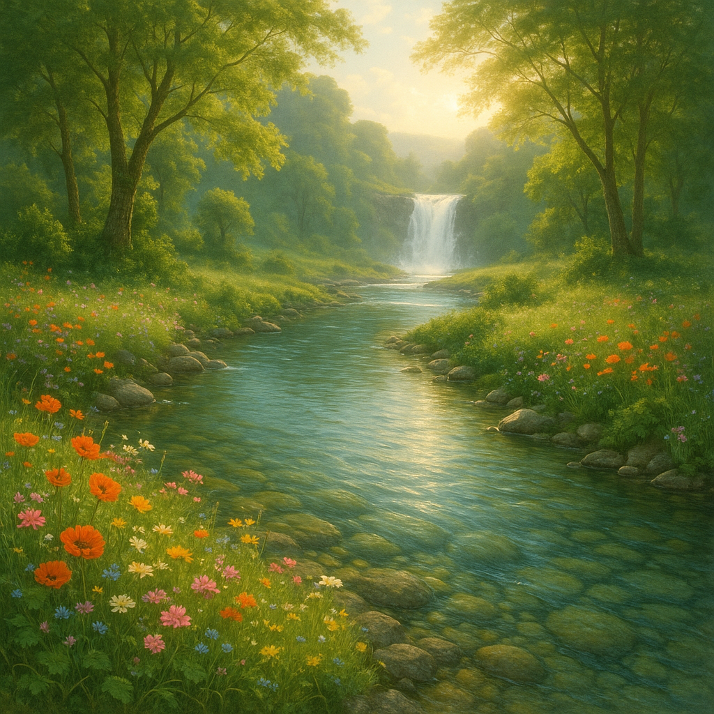
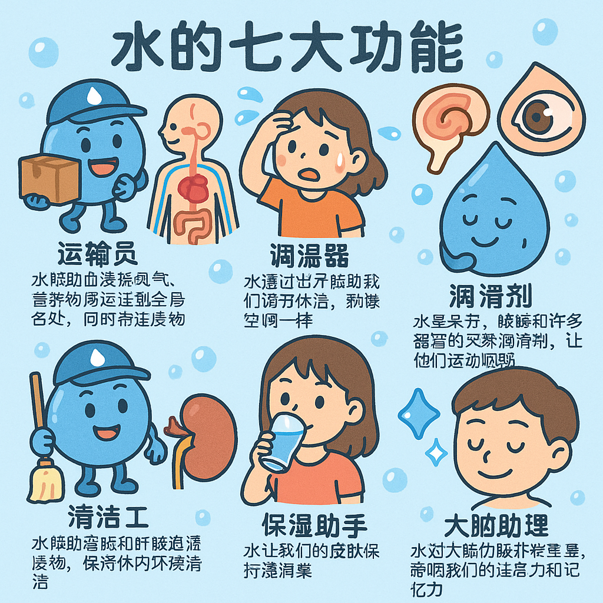
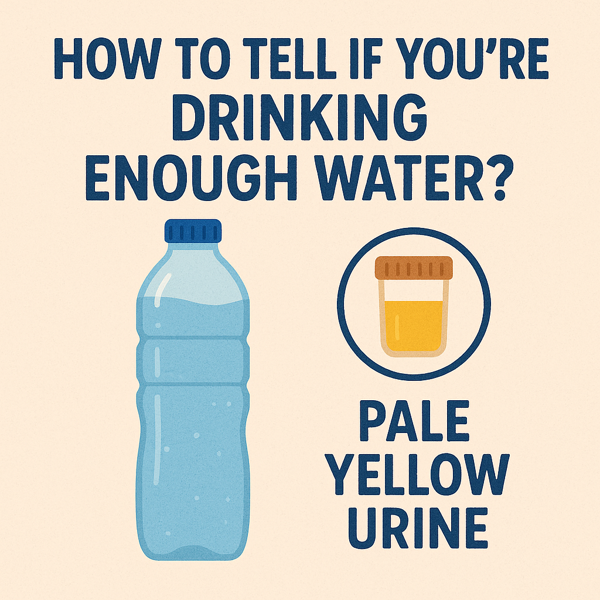

💧 喝水的重要性：身体的必需之源 💧

## 引言
小朋友们，你们知道吗？我们的身体有一个非常特别的朋友，它每天都在默默守护着我们的健康，它就是——水！虽然水没有颜色，没有味道，但它却是我们生命中最重要的物质之一。今天，让我们一起探索为什么喝水对我们如此重要，以及如何正确地补充水分吧！

<!--  -->

📸 **水是生命之源！** 

这张照片展示了晶莹剔透的水滴和充满活力的孩子们。水不仅滋润着地球上的一切生物，也是我们人体内最重要的成分之一。没有水，就没有生命！

## 1. 人体与水：你体内的海洋
你知道吗？我们的身体大部分都是由水组成的！

### 水在人体中的比例
- 👶 婴儿体内约75%是水
- 👦👧 儿童体内约65%是水
- 👨👩 成年人体内约60%是水
- 👴👵 老年人体内约55%是水

💡 **有趣知识**：如果一个小朋友重30公斤，那么他体内大约有19.5公斤的水！这相当于20瓶大矿泉水的量呢！🌊

### 水在人体中的分布
- 🩸 血液中约83%是水
- 🧠 大脑中约73%是水
- 💪 肌肉中约76%是水
- 🦴 骨骼中也含有约31%的水

## 2. 水的神奇功能：为什么我们需要喝水？
水在我们体内担任着许多重要的工作，就像一个忙碌的小助手！

### 水的七大功能
1. **运输员**：水帮助血液将氧气、营养物质运送到全身各处，同时带走废物
2. **调温器**：水通过出汗帮助我们调节体温，就像空调一样
3. **润滑剂**：水是关节、眼睛和许多器官的天然润滑剂，让它们运动顺畅
4. **清洁工**：水帮助肾脏和肝脏过滤废物，保持体内环境清洁
5. **消化助手**：水帮助我们消化食物，吸收营养
6. **保湿师**：水让我们的皮肤保持湿润柔软
7. **大脑助理**：水对大脑功能非常重要，影响我们的注意力和记忆力

<!--  -->

📸 **水的神奇功能！**

这张图片展示了水在人体内的各种重要功能。从头到脚，每个器官都需要足够的水分才能正常工作。看，水就像体内的万能小英雄！

## 3. 缺水的警告信号：身体在向你求救！
当我们体内的水不够时，身体会发出一些信号，告诉我们该喝水了。

### 缺水的常见信号
- 🥵 口渴（这是最明显的信号）
- 😴 感到疲倦或头晕
- 🤕 头痛
- 👄 嘴唇干裂
- 🟡 尿液颜色变深（健康的尿液应该是浅黄色）
- 😒 情绪烦躁
- 🤔 注意力不集中

💡 **小知识**：当你感到口渴时，其实身体已经有轻微缺水了！所以不要等到口渴才喝水，要养成经常喝水的好习惯。💧

## 4. 每天需要喝多少水？
不同的人需要喝的水量也不同，这取决于年龄、体重、活动量和天气等因素。

### 一般推荐饮水量
- 👶 1-3岁：约1-1.3升/天（4-5杯）
- 👦👧 4-8岁：约1.6升/天（5-6杯）
- 👧👦 9-13岁：约1.8-2.1升/天（7-8杯）
- 👱‍♀️👱‍♂️ 14岁以上：约2-3升/天（8-12杯）

🌡️ **夏天或运动时需要增加饮水量！**
当天气热或者你运动出汗多时，需要喝更多的水来补充流失的水分。

<!--  -->

📸 **如何判断是否喝够水？**

这张图片展示了判断是否喝够水的简单方法：观察尿液颜色。浅黄色表示水分充足，深黄色表示需要多喝水。这是一个简单但有效的方法！

## 5. 趣味喝水小技巧：让喝水变得有趣！
有些小朋友可能不太喜欢喝水，觉得水没有味道很无聊。来看看这些让喝水变得有趣的小技巧吧！

### 让喝水变有趣的7个方法
1. **彩色水杯**：用有趣的彩色杯子或有喜欢卡通人物图案的水杯
2. **水果味道**：在水中加入一些切片的水果，如柠檬、草莓、橙子或黄瓜
3. **喝水游戏**：设定喝水目标和奖励，比如喝完一杯水可以得到一颗小星星
4. **喝水提醒**：设定喝水闹钟，每小时提醒喝一小杯水
5. **冰块造型**：用特殊的模具制作各种形状的冰块，如星星、小动物等
6. **彩色吸管**：使用有趣的彩色吸管或形状独特的吸管
7. **水的故事**：讲述水在体内的奇妙旅行，激发兴趣

💡 **有趣知识**：植物和动物也需要水！一棵大树每天可能需要吸收几百升的水，而一头大象每天可能要喝150-300升的水！🐘🌳

## 6. 水与其他饮料：哪种更健康？
虽然市面上有各种各样的饮料，但纯净水仍然是最健康的选择。

### 饮料健康排行榜
1. **纯净水**：最佳选择，无糖、无添加剂
2. **矿泉水**：含有天然矿物质，适量饮用有益健康
3. **淡茶**：含有少量的抗氧化物质，但儿童应少喝或不喝
4. **果汁**：虽然有维生素，但也含有较多糖分，应适量饮用
5. **碳酸饮料**：含有大量糖分和添加剂，应尽量避免
6. **能量饮料**：含有咖啡因和大量糖分，儿童不宜饮用

⚠️ **注意**：饮料不能完全替代水！即使喝了其他饮料，也要确保每天喝足够的纯净水。

## 7. 水的记忆力实验：水对大脑的影响
大脑需要足够的水分才能正常运作。缺水会影响我们的思考能力、注意力和记忆力。

### 有趣的实验
- 🧠 **水与记忆力**：在做家庭作业或测验前喝一杯水，看看是否能提高记忆力和注意力
- 🧩 **水与解题能力**：在遇到难题时，先喝一杯水，休息一下，再尝试解决
- 📚 **水与学习效率**：保持一天充分的水分摄入，记录自己的学习效率变化

💡 **科学研究表明**：轻微缺水（仅损失体重的1-2%的水分）就可能导致注意力下降、头痛和疲劳感增加，影响学习和记忆。所以上学时别忘了带水壶！🧠💧

## 8. 世界各地的水资源：珍惜每一滴水
虽然地球表面71%被水覆盖，但只有不到1%的水是我们可以直接饮用的淡水。

### 珍惜水资源的小行动
1. 🚰 关紧水龙头，不让水白白流走
2. 🚿 洗澡时间控制在5-10分钟
3. 🥤 善用杯子里的剩水，可以用来浇花
4. 💧 发现漏水的水龙头时，及时告诉大人修理
5. 🌱 告诉朋友和家人节约用水的重要性

## 9. 喝水的正确方式
喝水也有学问，正确的喝水方式能让身体更好地吸收和利用水分。

### 喝水的小窍门
- ⏰ **均匀分配**：全天均匀喝水比一次喝大量的水更好
- 🥣 **餐前喝水**：餐前30分钟喝一杯水有助于消化
- 🍽️ **小口慢喝**：慢慢喝小口水比一口气喝完一大杯水更健康
- 🛌 **晨起一杯水**：起床后喝一杯温水能唤醒身体，补充夜间失去的水分
- 💤 **睡前适量**：睡前1-2小时可以喝少量水，避免夜间频繁起床

## 10. 水教会我们的事
水看似简单，却蕴含着深刻的道理：
- 生命中最重要的东西往往是最简单的
- 健康的秘诀有时就是坚持简单的好习惯
- 珍惜资源从身边小事做起
- 纯净透明如水，是一种美好的品质

### 🔬 科学小实验：观察水的神奇性质
如果有机会，可以尝试：
- 用一杯水和食用色素观察水的扩散现象
- 测量一天中不同时间点喝水前后的精神状态
- 在不同温度的环境中记录自己的饮水量变化

记住：水是生命之源，也是健康之本。养成良好的饮水习惯，让身体时刻保持充沛的能量和活力！💧✨ 