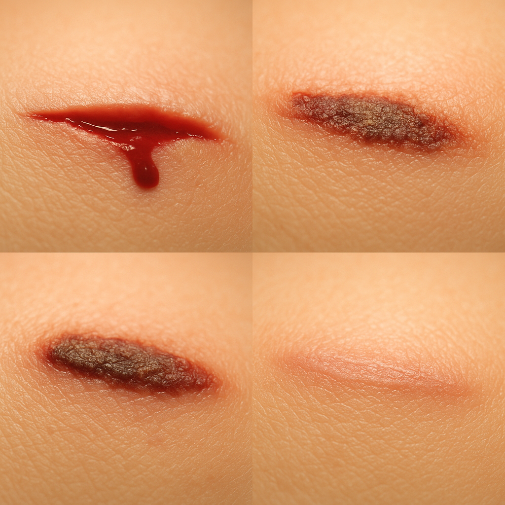
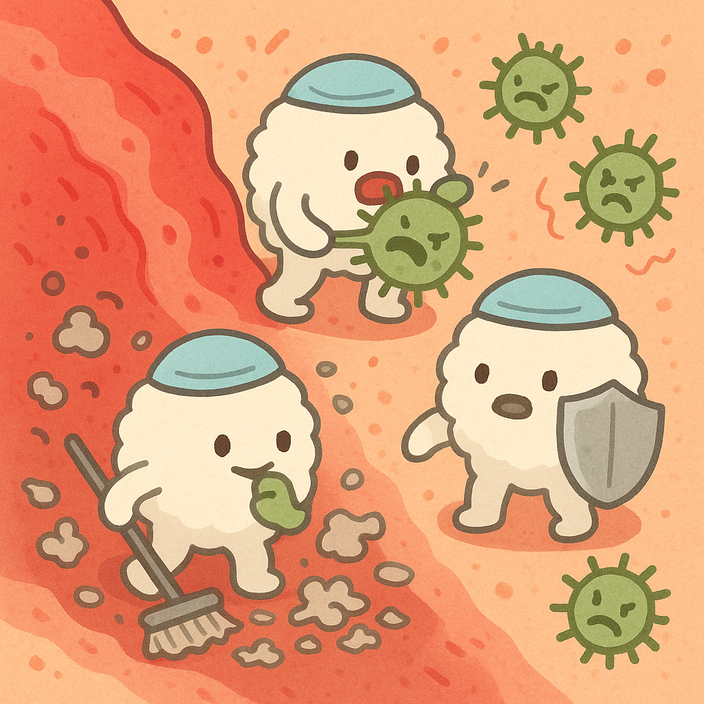
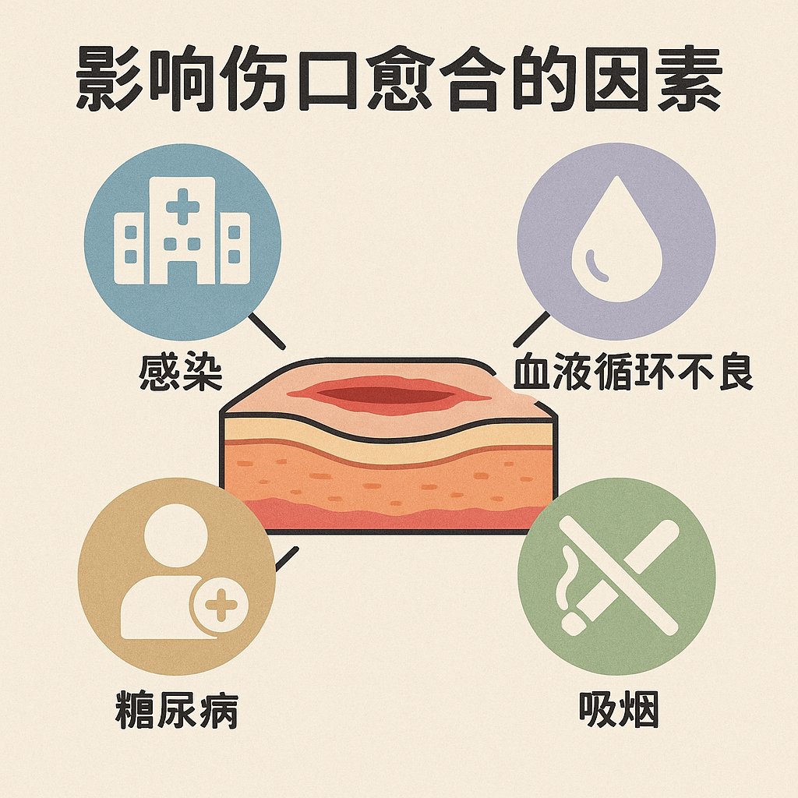

🩹 伤口的神奇愈合：身体的自我修复能力 🩹

## 引言
小朋友们，你们是不是曾经摔倒过，划伤过手指，或者碰破过膝盖？当我们受伤时，皮肤上会出现一个伤口，但神奇的是，过几天后伤口就会自己慢慢愈合，最后可能只留下一个小疤痕或者完全看不出来。这是为什么呢？今天我们就来探索身体这个神奇的自我修复能力！

📸 **伤口愈合的奇迹！** 

这张图片展示了伤口从受伤到愈合的整个过程。看，我们的身体就像有一支隐形的"修复队伍"，不停地工作，直到伤口完全修复好！

## 1. 伤口是怎么形成的？
当我们的皮肤受到伤害时，就会形成伤口。伤口可能由不同的原因造成：

### 常见的伤口类型
- 🔪 **划伤**：被锋利的物体（如纸张边缘、刀）划破的浅表伤口
- 💥 **擦伤**：皮肤与粗糙表面（如地面）摩擦造成的伤口，常有小石子或脏东西
- 👊 **挫伤**：皮肤受到撞击，表面可能没破但下面的组织受伤，形成"青紫"
- 🧷 **刺伤**：尖锐物体（如针、钉子）刺入造成的小而深的伤口
- ✂️ **撕裂伤**：皮肤被不规则地撕开的伤口

💡 **有趣知识**：我们的皮肤是人体最大的器官！成人的皮肤面积约有2平方米，相当于一张单人床的大小，厚度约为2毫米。这层"外衣"保护着我们身体内部的脏器和组织。🧥

## 2. 伤口愈合的四个阶段：身体的修复工程
伤口的愈合不是一蹴而就的，而是分为几个阶段逐步完成的！就像修房子一样，需要一步一步来。

### 第一阶段：止血（几分钟到几小时）
当我们受伤后，身体的第一反应是什么？没错，就是流血！

1. **血小板聚集**：血液中的血小板像小小的补丁一样聚集在伤口处
2. **形成血凝块**：血小板释放特殊物质，让血液凝固，形成"血痂"
3. **血管收缩**：受伤的血管会自动收缩，减少血液流出

💡 **小知识**：一滴血中大约含有25万个血小板！它们是血液中最小的细胞，没有细胞核，寿命只有8-10天。血小板就像身体的"急救员"，总是第一个赶到伤口现场！💉

### 第二阶段：炎症反应（1-4天）
伤口周围发红、肿胀、疼痛，这不是坏事，而是身体在积极工作！

1. **白细胞集合**：白细胞（特别是中性粒细胞和巨噬细胞）赶到伤口
2. **清理工作**：这些细胞吞噬细菌和死亡组织，就像清洁工一样
3. **防御作用**：防止细菌入侵，减少感染的可能

📸 **伤口的"清洁工作"！**

这张图片展示了白细胞如何在伤口处清除细菌和碎片。这些微小的卫士保护着我们的伤口不受感染，它们就像一支微型清洁队！

### 第三阶段：增生期（4-21天）
现在开始实际的"建设工作"了！

1. **形成肉芽组织**：新的血管和结缔组织开始生长
2. **纤维细胞活动**：产生胶原蛋白，为伤口搭建"骨架"
3. **边缘收缩**：伤口边缘慢慢向中间收缩，使伤口面积变小
4. **上皮细胞迁移**：皮肤表面的细胞开始从伤口边缘向中心移动，覆盖伤口

💡 **有趣知识**：胶原蛋白是人体内最丰富的蛋白质，约占总蛋白质的30%！它就像身体的"建筑材料"，不仅修复伤口，还保持皮肤弹性和强度。🏗️

### 第四阶段：重塑期（21天至1年或更长）
最后的"精细加工"阶段！

1. **疤痕成熟**：胶原纤维重新排列，使疤痕变平、变软
2. **色素恢复**：皮肤颜色逐渐回复正常
3. **强度增加**：伤口愈合区域的强度逐渐增加，但通常只能恢复到原来的80%左右

📸 **疤痕的变化！**

这张图片展示了疤痕如何随着时间的推移而变化。刚开始疤痕可能又红又凸，但随着时间的推移，它会变得更平坦、更不明显。

## 3. 超级英雄：参与伤口愈合的细胞们
伤口愈合的过程中，有很多微小的"英雄"在工作。让我们认识一下这些看不见的小帮手！

### 伤口愈合的细胞队伍
- 🛡️ **血小板**：第一反应小队，负责止血和发出信号
- 🚨 **中性粒细胞**：第一批到达的白细胞，吞噬细菌
- 🧹 **巨噬细胞**："大胃王"清洁工，清理伤口区域
- 🏗️ **纤维细胞**：建筑工人，产生胶原蛋白
- 🚚 **内皮细胞**：管道工，形成新的血管
- 🧱 **角质形成细胞**：铺路工，覆盖伤口表面

💡 **小知识**：我们体内有大约37兆个细胞！每时每刻，都有成千上万的细胞在分裂、工作和死亡，保持我们身体的正常运转。我们的身体就像一个繁忙的"细胞城市"！🏙️

## 4. 为什么有些伤口愈合得快，有些却很慢？
伤口愈合的速度受很多因素影响，就像种子生长需要适宜的条件一样。

### 影响伤口愈合的因素
1. **年龄**：小朋友的伤口通常愈合得比老年人快
2. **伤口大小和深度**：小伤口比大伤口愈合得快
3. **伤口位置**：面部等血液供应丰富的部位愈合较快
4. **营养状况**：身体需要足够的营养物质来修复伤口
5. **健康状况**：一些疾病（如糖尿病）会减慢愈合速度
6. **是否保持清洁**：受感染的伤口愈合较慢

📸 **伤口愈合的加速器与减速器！**

这张图片展示了促进和延缓伤口愈合的各种因素。良好的护理和健康的生活方式可以帮助伤口更快愈合！

## 5. 帮助伤口愈合的小秘诀
虽然身体有自己的修复系统，但我们可以做一些事情来帮助伤口更好地愈合。

### 伤口护理小贴士
1. 🧼 **保持清洁**：用清水和肥皂轻轻清洗伤口周围
2. 🔍 **及时处理**：受伤后应尽快清洁和处理伤口
3. 🩹 **适当包扎**：根据伤口类型选择合适的包扎方法
4. 💧 **保持湿润**：轻微伤口保持适当湿润有利于愈合
5. 🍎 **健康饮食**：摄入充足的蛋白质、维生素C和锌
6. 💤 **充分休息**：睡眠充足有助于身体修复
7. 👨‍⚕️ **严重伤口就医**：大的或深的伤口需要医生处理

💡 **有趣知识**：蜂蜜被用作伤口护理已有数千年的历史！它有天然的抗菌性质，能创造一个有利于伤口愈合的环境。当然，在使用任何家庭疗法前，最好先咨询医生。🍯

## 6. 疤痕的秘密：为什么有些伤口会留下疤痕？
疤痕是伤口愈合的自然结果，但不同的伤口会形成不同的疤痕。

### 关于疤痕的小知识
- 🔬 **疤痕组织**：疤痕是由胶原蛋白组成的，它的排列方式与正常皮肤不同
- 🌈 **疤痕颜色**：新疤痕通常是红色或粉色的，随着时间会变淡
- 👧👦 **儿童与疤痕**：儿童的皮肤生长快，有些疤痕可能随着成长而变得不明显
- 🧬 **个体差异**：有些人更容易形成明显的疤痕，这与遗传有关

💡 **小知识**：有一种特殊的疤痕叫做"瘢痕疙瘩"，它会长得比原来的伤口还大！这是因为身体产生了过多的胶原蛋白。这种疤痕更常见于深色皮肤的人群。

## 7. 动物界的伤口愈合能手
自然界中有些动物的伤口愈合能力非常惊人！

### 愈合能力超强的动物
1. 🦎 **壁虎**：能够再生断掉的尾巴
2. 🐙 **章鱼**：能够再生失去的触手
3. 🦀 **螃蟹**：能够再生断掉的螯
4. 🐌 **蜗牛**：能够修复受损的壳
5. 🌟 **海星**：从一条断臂可以长出整个新的海星

💡 **有趣问题**：为什么人类不能像壁虎那样再生断肢呢？这是因为我们的细胞分化程度更高，失去了某些"多能性"。科学家正在研究这些动物的再生能力，希望能应用于人类医学！🔬

## 8. 伤口愈合的科学研究与未来发展
科学家们一直在努力研究如何加速伤口愈合和减少疤痕形成。

### 伤口愈合的新技术
- 🔬 **生长因子**：帮助促进细胞生长的特殊蛋白质
- 🦠 **干细胞治疗**：利用干细胞的再生能力促进组织修复
- 🤖 **人工皮肤**：为严重烧伤患者提供皮肤替代品
- 🩹 **先进敷料**：含有抗菌成分或促进愈合物质的特殊敷料
- 💉 **基因治疗**：通过调整基因表达促进伤口愈合

## 9. 伤口愈合的小实验
想亲眼看看伤口愈合的过程吗？这里有几个安全的小实验！

### 科学小探索
1. 🍎 **苹果切面变色**：观察切开的苹果如何变褐色（类似伤口的氧化过程）
2. 📝 **伤口日记**：记录自己小伤口愈合的过程（拍照记录，但不要故意弄伤自己！）
3. 🔍 **显微镜观察**：如果有条件，可以用显微镜观察自己的皮肤和血液

## 10. 伤口愈合教会我们的事
伤口愈合的过程蕴含着许多人生哲理：

- 时间可以治愈伤痛，就像伤口会随着时间而愈合
- 每个困难都是暂时的，就像伤口不会永远存在
- 有时候我们需要适当的"疼痛"才能成长
- 坚持和耐心是克服困难的关键
- 即使留下疤痕，也是成长经历的见证

## 延伸阅读：认识更多关于身体的神奇能力
如果你对身体的自我修复能力感兴趣，可以继续了解：
- 🧠 大脑的可塑性：大脑如何"修复"和适应
- 🦴 骨折的愈合过程：骨头如何自我修复
- 🧪 免疫系统：身体如何抵抗疾病
- 🩸 血液循环：血液如何运送修复所需的物质

### 🔬 科学小实验：观察皮肤的神奇性质
如果有机会，可以尝试：
- 用放大镜观察自己的皮肤纹路
- 比较不同年龄人的皮肤弹性
- 观察划痕在不同部位愈合的速度差异

记住：我们的身体有着惊人的自愈能力，这是大自然赋予我们的礼物！每一次小伤口的愈合，都是生命顽强的证明。🩹✨ 